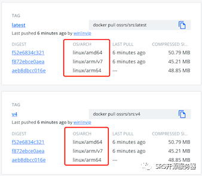

# Docker: SRS支持x86/armv7/aarch64镜像

最近我发现有个趋势哈，就是ARM server越来越多，但是ARM好像不像x64平台那么好识别，总是有各种各样的arm识别不了。如果SRS能出ARM的docker镜像，那会比较容易跑起来。

SRS已经支持了多CPU架构的docker镜像，如下图所示：



下面是用法和技术背景。

## Usage

现在SRS支持了多个CPU架构，参考ossrs/srs[1]：

- •  `linux/amd64` 这就是x86_64架构，Intel的64位服务器，目前主要的Linux服务器都是这种类型，无论任何操作系统只要是这个芯片都可以用这个镜像。苹果Mac Intel芯片也是可以用这个镜像。

- •  `linux/arm/v7` 这是armv7也就是32位架构，比如RaspberryPI就是这种服务器，如果你要在PI上使用SRS，可以用这个镜像。我没有硬件验证，所以欢迎大家测试反馈。

- •  `linux/arm64/v8` 这就是armv8也就是64位架构，目前一般的ARM云服务器都是这种架构，无论任何操作系统都可以用这个镜像。苹果Mac M1芯片，应该是可以用这个镜像的，我没有硬件所以欢迎大家测试反馈。

> Note: 国内可以用阿里云镜像registry.cn-hangzhou.aliyuncs.com/ossrs/srs[2]，注意没有显示多CPU架构，但也是支持的。

具体用法和之前是一样的，docker会根据机器的CPU架构，选择合适的镜像执行。所以用法没有变更，举一个简单例子：

```
docker run --rm -it -p 1935:1935 -p 1985:1985 -p 8080:8080 \
    ossrs/srs:4 ./objs/srs -c conf/docker.conf
```

国内可以用阿里云镜像，比如：

```
docker run --rm -it -p 1935:1935 -p 1985:1985 -p 8080:8080 \
    registry.cn-hangzhou.aliyuncs.com/ossrs/srs:4 ./objs/srs -c conf/docker.conf
```

更多的例子可以参考Wiki：

- • SRS 4.0中文[3]

- • SRS 4.0 English[4]

- • SRS 5.0中文[5]

- • SRS 5.0 English[6]

下面是支持多CPU架构的镜像的其他背景，若你需要修改代码了自己打镜像，或者需要支持其他CPU架构，可以参考下面的资料支持。

> Note: 除了SRS镜像，SRS的开发镜像中，CentOS 7[7]和Ubuntu 20[8]支持了多CPU架构，注意CentOS不支持`linux/arm/v7`详细请参考本文后面的详细描述。

## Verify

如果需要验证arm/v7架构，可以选择RaspberryPI。目前云主机都是arm64/v8的架构。

实际上SRS可以支持多种CPU，比如x86_64、arm、aarch64、mips、loongarch等，具体请参考ST:适配[9]，但是要支持这些CPU的docker镜像需要再单独适配。

可以选择云主机验证ARM的docker，腾讯云ARM[10]，阿里云ARM[11]，华为云鲲鹏[12]，AWS ARM[13]。

执行命令，查看机器的CPU架构：

```
# uname -p
aarch64
```

启动docker，查看容器中的CPU架构：

```
docker run -it --rm ossrs/srs:ubuntu20 uname -p
aarch64

docker run -it --rm registry.cn-hangzhou.aliyuncs.com/ossrs/srs:ubuntu20 uname -p
aarch64
```

开发镜像验证完成。我们验证下SRS的镜像，在一台ARM云主机上，CPU架构是`aarch64`也就是`linux/arm64/v8`，执行命令：

```
docker run --rm -it registry.cn-hangzhou.aliyuncs.com/ossrs/srs:v4 ldd objs/srs
    libdl.so.2 => /lib/aarch64-linux-gnu/libdl.so.2 (0x0000ffff97240000)
    libpthread.so.0 => /lib/aarch64-linux-gnu/libpthread.so.0 (0x0000ffff97200000)
    libstdc++.so.6 => /lib/aarch64-linux-gnu/libstdc++.so.6 (0x0000ffff97010000)
    libm.so.6 => /lib/aarch64-linux-gnu/libm.so.6 (0x0000ffff96f60000)
    libgcc_s.so.1 => /lib/aarch64-linux-gnu/libgcc_s.so.1 (0x0000ffff96f30000)
    libc.so.6 => /lib/aarch64-linux-gnu/libc.so.6 (0x0000ffff96db0000)
    /lib/ld-linux-aarch64.so.1 (0x0000ffff97c10000)
```

可以看到docker正确下载了`aarch64`架构的镜像，验证完成。

## SRS Image

若你需要自己打SRS的多CPU架构镜像，可以详细看这一节的内容。

> Note: 由于基础开发镜像ossrs/srs:ubuntu20[14]支持多CPU架构后，SRS镜像的编译就比较简单，只需要从`ossrs/srs:dev`修改成`ossrs/srs:ubuntu20`，同时从CentOS切换到Ubuntu安装命令要修改；发布的镜像，从CentOS改成Ubuntu，详细修改请参考Commit：xxxx

操作起来很简单，可以调用命令打包就行：

```
docker buildx create --name mybuilder --driver docker-container
docker buildx use mybuilder

cd ~/git/srs
docker buildx build --platform linux/arm/v7,linux/arm64/v8,linux/amd64 \
  --output "type=image,push=true" --progress plain --build-arg JOBS=10 \
  --tag your-repository/ossrs/srs:4 -f trunk/Dockerfile .
```

> Note: 记得修改`--tag`为你的仓库的镜像就可以。

## Multiple CPU Image

之前SRS的docker实际上只支持了x86_64架构，所以在ARM和其他CPU上是没法跑的，参考SRS[15]。其实镜像是可以支持多个架构的，参考手动打多CPU架构镜像[16]。

为了了解docker的多CPU架构镜像，我们先尝试一个简单的镜像，没有任何依赖。

首先，新建一个Dockerfile，它的FROM是带ARCH前缀：

```
ARG ARCH
FROM ${ARCH}debian:buster-slim

RUN apt-get update \
&& apt-get install -y curl \
&& rm -rf /var/lib/apt/lists/*

ENTRYPOINT [ "curl" ]
```

若在Mac下，需要创建一个builder，例如：

```
docker buildx create --name mybuilder --driver docker-container
docker buildx use mybuilder
```

然后，使用docker buildx编译镜像：

```
docker buildx build --push --platform linux/arm/v7,linux/arm64/v8,linux/amd64 \
  -t ossrs/srs:multiarch-example .
```

若需要上传到其他registry比如阿里云，可以再运行一次，docker有缓存：

```
docker buildx build --push --platform linux/arm/v7,linux/arm64/v8,linux/amd64 \
  -t registry.cn-hangzhou.aliyuncs.com/ossrs/srs:multiarch-example .
```

这样就打包并上传了一个多CPU架构的镜像：

```
# docker manifest inspect ossrs/srs:multiarch-example

{
   "manifests": [
      { "platform": { "architecture": "arm", "variant": "v7" }  },
      { "platform": { "architecture": "arm64", } },
      { "platform": { "architecture": "amd64", } }
   ]
}
```

可以在docker hub上看到这个镜像，包含多个CPU架构。

## GitHub Actions

SRS是使用GitHub Actions自动打镜像，并上传到Docker和Aliyun的镜像仓库。

在`.github/workflows/release.yml`中，需要加一个步骤，安装buildx：

```
      # See https://github.com/crazy-max/ghaction-docker-buildx#moved-to-docker-organization
      # https://github.com/docker/setup-qemu-action
      - name: Set up QEMU
        uses: docker/setup-qemu-action@v1
      # https://github.com/docker/setup-buildx-action
      - name: Set up Docker Buildx
        uses: docker/setup-buildx-action@v1
```

> Note: 注意最新的是用的qemu和官方docker的actions，很多文档还是老的。

## Multiple Repositories

多CPU架构的镜像，不能使用一般的方式直接推送多仓库，需要使用一个独立的action。

在`.github/workflows/release.yml`中，需要加一个步骤，推送多个仓库：

```
      - name: Login aliyun hub
        uses: docker/login-action@v1
        with:
          registry: registry.cn-hangzhou.aliyuncs.com
          username: "${{ secrets.ACR_USERNAME }}"
          password: "${{ secrets.ACR_PASSWORD }}"
      - name: Push to Aliyun registry
        uses: akhilerm/tag-push-action@v2.0.0
        with:
          src: ossrs/srs:${{ env.SRS_TAG }}
          dst: |
            registry.cn-hangzhou.aliyuncs.com/ossrs/srs:${{ env.SRS_TAG }}
```

> Note: 由于buildx涉及到了manifest，所以不能直接用docker tag和docker push。

## ARG

参数ARCH只能在FROM中用，还可以根据目标平台在FROM之后做判断：

```
ARG ARCH
FROM ${ARCH}centos:7 as build

ARG BUILDPLATFORM
ARG TARGETPLATFORM
RUN echo "BUILDPLATFORM: $BUILDPLATFORM, TARGETPLATFORM: $TARGETPLATFORM"
```

> Note: 注意ARCH在FROM之前申明，只能在FROM中使用。

## Issues

CentOS7的镜像，无法支持`linux/arm/v7`，会出现错误：

```
ARG ARCH
FROM ${ARCH}centos:7

RUN yum install -y curl

ENTRYPOINT [ "curl" ]
```

执行命令：

```
docker buildx build --platform linux/arm/v7 .
```

出现错误，并一直卡死：

```
[+] Building 29.0s (5/6) 
 => [2/2] RUN yum install -y curl                                                                                        25.7s
 => => # qemu: uncaught target signal 11 (Segmentation fault) - core dumped 
```

> Note: 换成CentOS8也不支持armv7。

换成Ubuntu20就没有问题：

```
ARG ARCH
# http://releases.ubuntu.com/focal/
FROM ${ARCH}ubuntu:focal

ENV DEBIAN_FRONTEND noninteractive
RUN apt-get update && apt-get install -y curl

ENTRYPOINT [ "curl" ]
```

三个平台都能编译：

```
docker buildx build --platform linux/arm/v7,linux/arm64/v8,linux/amd64 .
```

所以SRS准备切换成Ubuntu20的基础开发镜像。

## Debug Building SRT

编译某个平台比如`linux/arm/v7`的SRT，先对代码打包：

```
cd ~/git/srs
tar cf srs.tar trunk
```

然后修改`trunk/Dockerfile`，直接编译SRT：

```
ARG ARCH
FROM ${ARCH}ossrs/srs:ubuntu20 AS build

ARG BUILDPLATFORM
ARG TARGETPLATFORM
RUN echo "BUILDPLATFORM: $BUILDPLATFORM, TARGETPLATFORM: $TARGETPLATFORM"

# https://serverfault.com/questions/949991/how-to-install-tzdata-on-a-ubuntu-docker-image
ENV DEBIAN_FRONTEND noninteractive

# Install depends tools.
RUN apt-get update && apt-get install -y gcc make g++ patch unzip perl git

ARG SRS_AUTO_PACKAGER

############ TEST
ADD srs.tar /srs
WORKDIR /srs/trunk/3rdparty/srt-1-fit
RUN apt-get install -y libssl-dev
RUN ./configure --disable-app  --enable-static --enable-c++11=0 --enable-shared=0
RUN echo "CMakeOutput.log" && cat /srs/trunk/3rdparty/srt-1-fit/CMakeFiles/CMakeOutput.log
RUN echo "CMakeError.log" && cat /srs/trunk/3rdparty/srt-1-fit/CMakeFiles/CMakeError.log
RUN exit 1
```

执行命令：

```
docker buildx create --name mybuilder --driver docker-container
docker buildx use mybuilder
cd ~/git/srs && docker buildx build --platform linux/arm/v7 -f trunk/Dockerfile --progress=plain .
```

这样相当于直接编译SRT，调试周期很短。

#### 引用链接

`[1]` ossrs/srs: *https://hub.docker.com/repository/docker/ossrs/srs/tags?page=1&ordering=last_updated*  
`[2]` registry.cn-hangzhou.aliyuncs.com/ossrs/srs: *https://cr.console.aliyun.com/repository/cn-hangzhou/ossrs/srs/images*  
`[3]` SRS 4.0中文: *https://github.com/ossrs/srs/wiki/v4_CN_Home#docker*  
`[4]` SRS 4.0 English: *https://github.com/ossrs/srs/wiki/v4_EN_Home#docker*  
`[5]` SRS 5.0中文: *https://github.com/ossrs/srs/wiki/v5_CN_Home#docker*  
`[6]` SRS 5.0 English: *https://github.com/ossrs/srs/wiki/v5_EN_Home#docker*  
`[7]` CentOS 7: *https://github.com/ossrs/dev-docker/tree/dev*  
`[8]` Ubuntu 20: *https://github.com/ossrs/dev-docker/tree/ubuntu20*  
`[9]` ST:适配: *https://github.com/ossrs/state-threads/issues/22*  
`[10]` 腾讯云ARM: *https://cloud.tencent.com/act/pro/Arm-Public*  
`[11]` 阿里云ARM: *https://www.aliyun.com/daily-act/ecs/ecs_arm*  
`[12]` 华为云鲲鹏: *https://console.huaweicloud.com/ecm/?agencyId=a8e897a228be41418dc40d36a3c5a384®ion=cn-east-3&locale=zh-cn#/ecs/createVm*  
`[13]` AWS ARM: *https://ap-northeast-1.console.aws.amazon.com/ec2/v2/home?region=ap-northeast-1#LaunchInstances:*  
`[14]` ossrs/srs:ubuntu20: *https://github.com/ossrs/dev-docker/tree/ubuntu20*  
`[15]` SRS: *https://hub.docker.com/r/ossrs/srs/tags*  
`[16]` 手动打多CPU架构镜像: *https://www.docker.com/blog/multi-arch-build-and-images-the-simple-way/*