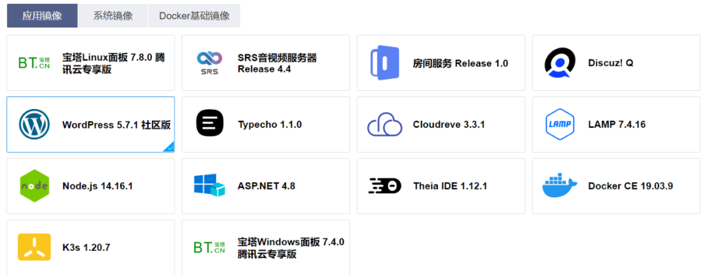
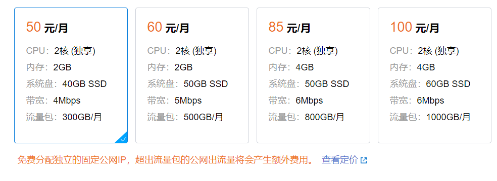
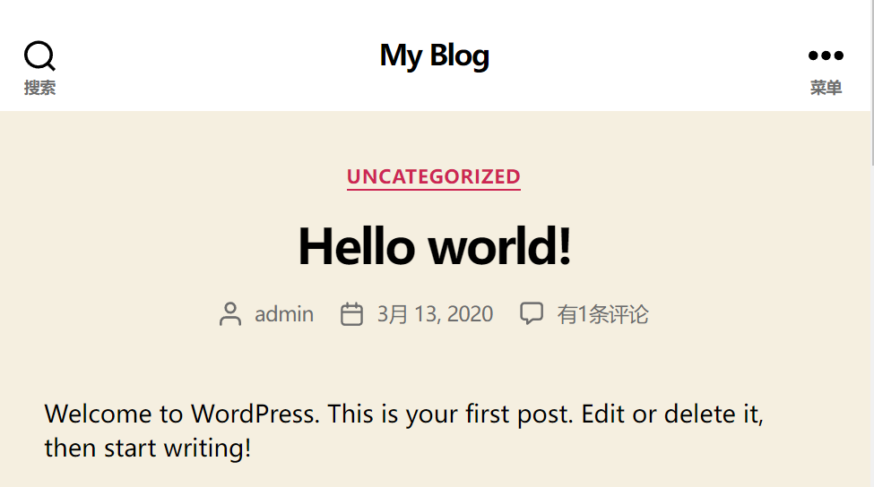
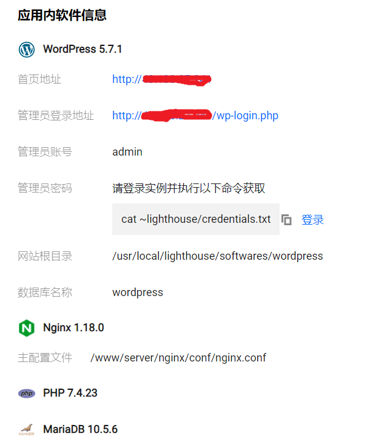
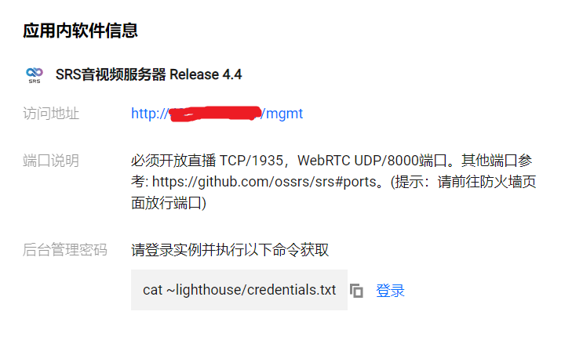
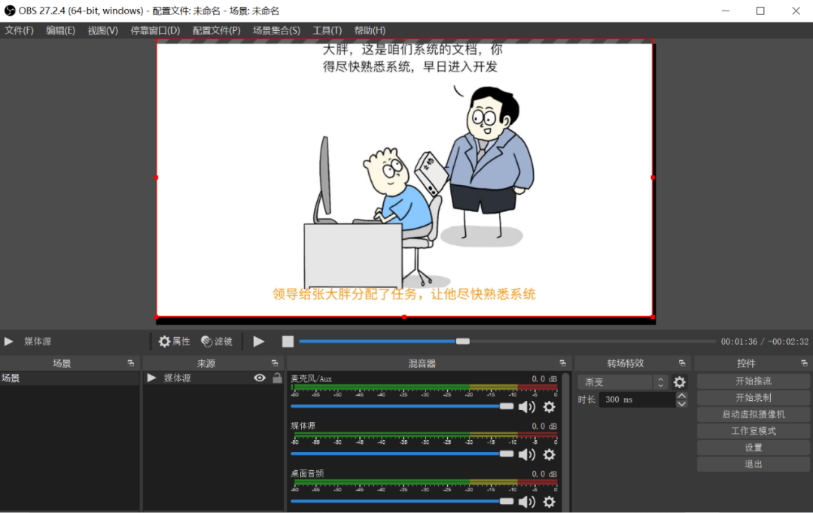
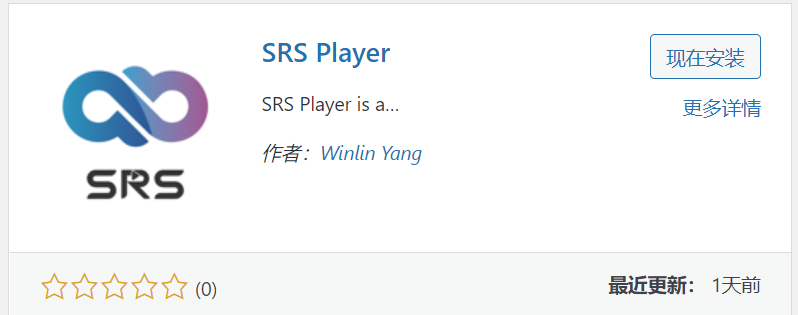
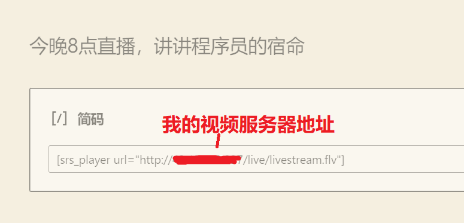
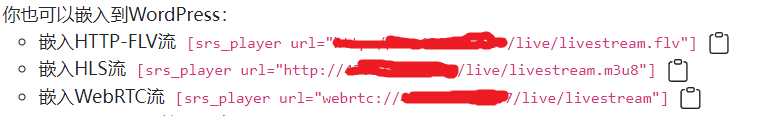
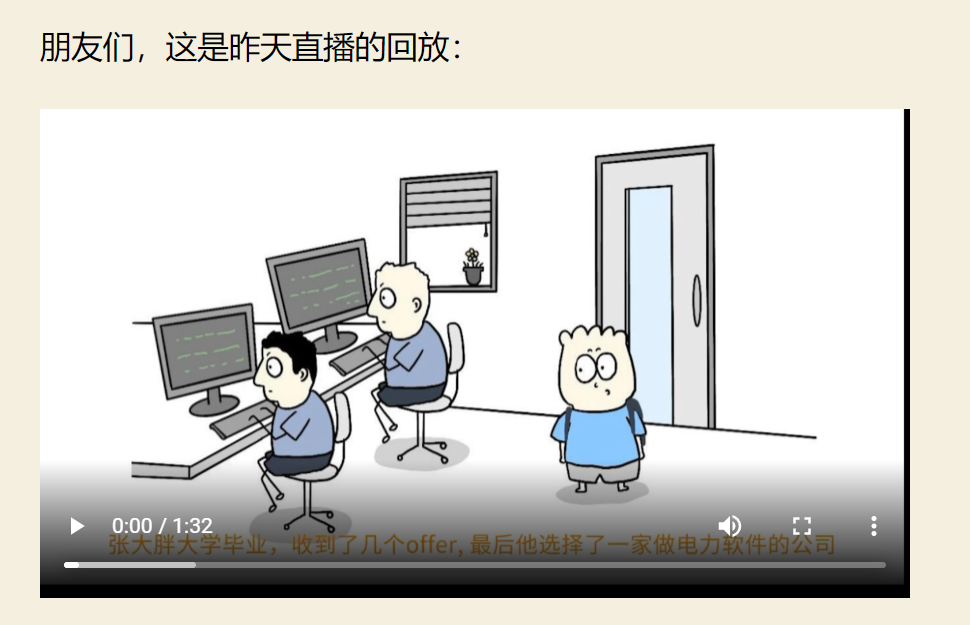

# 买了个精装房，准备搬家！

原创 准备搬家的 码农翻身 *2022-04-19 10:00*

不知不觉，我的公众号「码农翻身」已经积累了800多篇原创文章，但是微信自成一体，文章没法被Google、百度等搜索引擎索引，没法被更多人看到，这挺可惜的。

前段时间和朋友聊到这件事，他建议我搭建一个个人网站，把文章搬运过去，这样不依赖别的博客平台，完全“自主可控”，如果做好SEO，流量大了还可以通过广告变现赚点儿外快。

## 建个人网站 ##

我有点动心，独立建站应该不难，需要买个云端的虚拟机，申请域名，然后找个博客系统装上。 

搜了一圈发现，现在不少博客系统是用PHP写的！包括大名鼎鼎的WordPress，需要安装PHP、MySQL等软件，然后进行配置。

我去某家云平台申请虚拟机的时候一下子被吓住了，需要选择的参数太多了！什么地域、可用区，安全组、资源组、私有池、快照，每个都得仔仔细细地阅读理解，让人头脑发蒙。 

我就是想弄个虚拟机安装博客系统而已，真的需要把这么多复杂的概念都一股脑暴露出来吗？

考虑到后续还得配置我不熟悉的PHP，我这个懒人就有点儿打退堂鼓了。 

不过，在放弃之前，我又搜索了一圈，无意间发现了腾讯云在提供一个叫做Lighthouse的轻量应用服务器，说是自带应用镜像，开箱即用。

我试了一下，第一步选取应用镜像：

这里提供了很多镜像，有做博客系统的Typecho、WordPress，有Discuz!Q论坛，还有SRS音视频服务器，Web IDE，网盘Cloudreve等等，琳琅满目。

我选择了大名鼎鼎的WordPress，插件最多，生态最丰富。

第二步就是选套餐：

然后我啥也没做，稍等片刻，**一个具有公网IP的博客平台就跑起来了**：

系统后台显示，已经内置WordPress、Nginx、PHP、MariaDB等软件。 

可见腾讯云Lighthouse确实实现了开箱即用，屏蔽掉了很多细节，根本不用配置PHP、MySQL，安装配置博客系统，仅仅是点了几个按钮以后，我就可以开启我的博客“事业”了。

如果说传统的虚拟机像毛坯房，**这个自带应用镜像的Lighthouse就是精装房，可以让我拎包入住，省心省事**。

**视频和直播**

我高兴地把博客IP地址发给朋友，他也很惊讶我这么快就搞起来了。

不过他又给我出了一个主意：你的博客是图文的，落伍了！现在视频和直播这么火爆，也要紧跟时代潮流啊！

视频和直播？

这玩意儿我从来没有弄过，这么高级的东西，搭建自己系统的难度应该会比简单的博客高几个数量级吧？

我猛然想起，刚才创建博客的时候，Lighthouse 的应用镜像不是可以支持SRS音视频服务器吗？！ 

赶紧试一下，还是简单的步骤，新创建一个Lighthouse，不过这次要选择“SRS音视频服务器”镜像，片刻之后，一个带公网IP的音视频服务器便创建好了。

SRS音视频服务器的配置要比博客复杂一点点，因为它要涉及到直播方和观看方，基本的原理是：

- 我的电脑上需要下载一个软件OBS。
- OBS把我的直播视频以流的方式推送给我刚刚建立的SRS音视频服务器
- 各种客户端就可以访问服务器来看直播了。

听起来也不难，根据教程，几分钟就搞定了。

这里不得不赞一下Lighthouse的文档，写得精炼又贴心，很多辅助功能（例如复制各种密码和地址，打开相关链接）非常好用。

1. 把防火墙端口TCP/1935，UDP/8000打开

2. 下载安装桌面版的OBS软件

这个软件用起来比较直观，设置下音视频服务器地址和密钥，然后就可以推流了。

测试期间，我选择了本地的一个视频《程序员的宿命》播放，代替直播。

3. 开始推流，打开浏览器，使用内置的简单播放器测试一下，成功看到直播画面。

但是，总不能每次都给读者发直播的URL吧，那样太麻烦！

能把直播画面集成到我的博客中去吗？ 

腾讯云为WordPress提供了一个叫做SRS Player的博客插件：

安装以后，我只需要在博客文章中加上一行代码就可以搞定：

Tips : 这行代码甚至都不用手工敲，从SRS音视频服务器的控制台很贴心地提供了复制的功能：

然后打开博客文章，就可以看到激动人心的直播场景了：

真是没有想到，搞一个直播竟然如此简单！

如果有小伙伴没有赶上直播怎么办？Lighthouse的SRS控制台贴心地提供了**云点播**的功能，直播的视频流都可以**自动录制**下来。云点播是「**腾讯云音视频**」提供的服务，不愧是市场份额Top1的视频云服务商，体验十分丝滑。

再把录制好的MP4视频链接添加到WordPress博客上：

小伙伴们就可以观看回放了：

**总结一下**

深度体验了一番Lighthouse，深深地体会到这真是一个适合开发者的轻量级服务器，开箱即用，用极短的时间就把博客+直播+视频给搞起来了。

除了上述功能，Lighthouse还可以构建Web应用、小程序/小游戏、APP、电商应用、云盘/图床和各类开发测试环境。强烈推荐大家都来尝试一下这些“精装房”！

我决定就在这里安家了，续费，升级套餐。剩下还有些事情要做：购买域名，设置Https，网站备案等等。

对了，还有一个棘手的问题，如何把微信公众号的800多篇文章给搬运过来，我相信万能的WordPress是可以做到的，不说了，我搜个插件去……

PS：可能有些同学更喜欢清爽的博客系统Typecho，Lighthouse也有应用镜像，和WordPress一样，两三步就可以跑起来，只是Typecho现在没有像WordPress那样的插件市场，想支持直播的话，需要手工安装SRS Player插件，可以参考这篇文档：https://gitee.com/ossrs/Typecho-Plugin-SrsPlayer#install

最后，肯定要来点儿福利了：

这款轻量级云服务器除了好用还不贵，可以说超出预期的优惠，在活动期购买可以享受更大的折扣，爆款2核2G 5M新用户还能免费试用一个月。感兴趣的小伙伴可以扫码领取。

点击阅读原文，也可以免费领取。
